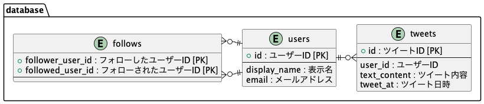

# Twitter clone application

## 利用技術

- database MySQL 8.0
- backend Go 言語
- frontend Next.js

## データベース設計



## 開発環境構築手順

`docker-compose.yml` で mysql を起動します。 docker-desktop や rancher-desktop などをインストールしてください。

asdf を使って Go や Node.js のバージョン管理します。 `.tool-versions` に記載されたバージョンをインストールしてください。

```
asdf install golang x.x.x
asdf install nodejs x.x.x
```

### データベース

```bash
cd backend
docker compose up # データベースサーバーを起動
mysql -h 127.0.0.1 -uroot -pmysql < database/initialize.sql # データベース作成
DATABASE_NAME=twitter_clone_app_development go run database/migrator/main.go # マイグレーション(development)
DATABASE_NAME=twitter_clone_app_test go run database/migrator/main.go # マイグレーション(test)
mysql -h 127.0.0.1 -uroot -pmysql twitter_clone_app_development < database/seeds.sql # シードデータ投入(development)
mysql -h 127.0.0.1 -uroot -pmysql twitter_clone_app_test < database/seeds.sql # シードデータ投入(development)
```

### サーバー

```bash
cd backend
go mod download # packageのダウンロード
go run main.go # 開発用サーバーを起動
```

### フロント

```bash
cd frontend
yarn install # packageのダウンロード
yarn dev # 開発用サーバーを起動
```
